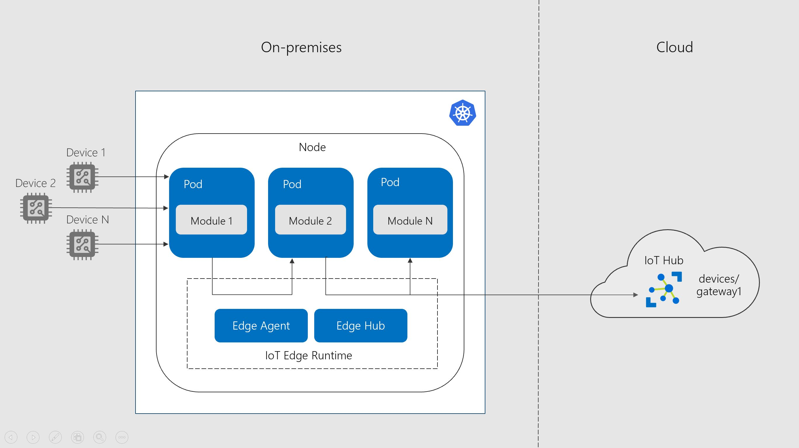

# Azure IoT Edge on Kubernetes: High Availability on the Edge 

Edge devices are often used as [gateways](https://docs.microsoft.com/en-us/azure/iot-edge/iot-edge-as-gateway) to serve as a point of aggregation and compute for other devices/sensors. Configuring and managing gateway devices is challenging in systems that require high availability due the fact they tend to be a single point of failure.

**Azure IoT Edge on Kubernetes** allows us to introduce some redundancy at the gateway layer so that workloads can be migrated over to another gateway device in the event of a complete device failure.

## Bring your own cluster

In a real world scenario,  the solution is designed to enable IoT Edge deployments on existing Kubernetes clusters to provide high availability. This is what we call **"bring-your-own-cluster"** scenario where the assumption is that an existing on-prem cluster is already available and ready to go. You can simply deploy your IoT Edge modules as another Kubernetes application and hit the ground running!

## Concepts

Before running this lab, it's important to understand concepts behind all components and how they interact with each other in the Kubernetes cluster. Take a look on the [Concepts](./docs/concepts.md) section to get detailed info.

## About the Lab

In this lab we are going to get our hands on the IoT Edge on Kubernetes. It is based on [Azure Kubernetes Service (AKS)](https://docs.microsoft.com/en-us/azure/aks/intro-kubernetes) with Linux nodes in order to simplify the cluster deployment and management, but you have to consider an on-prem cluster in a real world scenario.

## Prerequisites

- Linux or Windows 10 with [Windows Subsystem for Linux (WSL)](https://docs.microsoft.com/en-us/windows/wsl/about)
- Azure resources tools: [Azure CLI](https://docs.microsoft.com/en-us/cli/azure/install-azure-cli?view=azure-cli-latest) + [IoT extension](https://github.com/Azure/azure-iot-cli-extension), [Terraform](https://docs.microsoft.com/en-us/azure/virtual-machines/linux/terraform-install-configure?toc=%2Fen-us%2Fazure%2Fterraform%2Ftoc.json&bc=%2Fen-us%2Fazure%2Fbread%2Ftoc.json#install-terraform) and [Helm CLI](https://docs.helm.sh/using_helm/#install-helm)
- Development tools: [Visual Studio Code](https://code.visualstudio.com/) + [Azure IoT Edge extension](https://marketplace.visualstudio.com/items?itemName=vsciot-vscode.azure-iot-edge)

## Getting Started

This lab is divided in the following steps:

- [Step 1: Create Azure Resources](./docs/create-azure-resources.md)
- [Step 2: Register gateway devices on IoT Hub](./docs/register-gateway-devices.md) 
- [Step 3: Setup Kubernetes cluster](./docs/setup-aks-cluster.md)
- [Step 4: Deploy Edge modules](./docs/deploy-edge-modules.md)
- [Step 5: Setup Persistent Storage for Edge Security Deamon](./docs/persistent-storage-deamon.md)