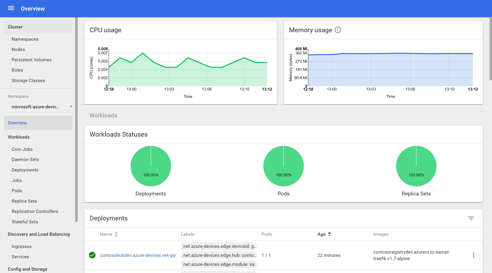
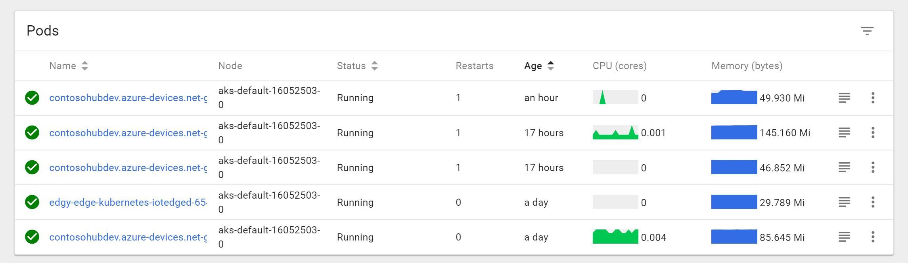

# Deploy IoT Edge modules

In this step we are going to create and deploy an IoT Edge module that filters sensor data into the Kubernetes cluster. You can use the Edge module developed in C# available in the `src/EdgeSolution` folder or create one from scratch by following the tutorial described [here](https://docs.microsoft.com/en-us/azure/iot-edge/tutorial-csharp-module).

*Note: It's not mandatory to develop your Edge module in C#. As you can see in the documentation you can develop in different languages like C, Node.js, Python and Java.*

## Update the Edge Agent module image

When you create a new IoT Edge solution, the following image is used by default:

    mcr.microsoft.com/azureiotedge-agent:<IMAGE_VERSION>

That image is the Edge agent that is installed on the edge device, but in our case we need the image that will be installed on the Kubernetes cluster:

    azureiotedge/azureiotedge-agent:<IMAGE_VERSION>

To do that, open the `deployment.template.json` located in your project root folder and find the `edgeAgent` property:

```json
"systemModules": {
    "edgeAgent": {
        "type": "docker",
        "settings": {
            "image": "mcr.microsoft.com/azureiotedge-agent:1.0",
            "createOptions": {}
        }
    },
    ...
}
```

Then update the `image` property by the new image:

```json
"systemModules": {
    "edgeAgent": {
        "type": "docker",
        "settings": {
            "image": "azureiotedge/azureiotedge-agent:0.1.0-alpha",
            "createOptions": {}
        }
    },
    ...
}
```

***Important:** At the time of this writing, the edge agent image is on version **0.1.0-alpha**. Make sure to check if there is a new version available.*   

## Build and deploy the image to Container Registry

### **Option 1: Build and deploy through Visual Studio Code**

If you want to build and deploy the image through VS Code, folow the tutorial described [here](https://docs.microsoft.com/en-us/azure/iot-edge/tutorial-csharp-module#build-your-iot-edge-solution). 

### **Option 2: Build and deploy through command line**

Sign in to Docker by entering your Container Registry credentials:

```sh
docker login -u <ACR username> -p <ACR password> <ACR login server>
```

Access your module folder (if you're using the sample available in this repo, the path is `src/EdgeSolution/modules/SampleModule`)  and build the image:

```sh
docker build -t <REGISTRY_NAME>.azurecr.io/<MODULE_NAME>:0.0.1-amd64 .
```

Then push the image to Container Registry:

```sh
docker push <REGISTRY_NAME>.azurecr.io/<MODULE_NAME>:0.0.1-amd64
```

## Deploy the module to the Edge device

### **Option 1: Deploy through Visual Studio Code**

If you built the image in the previous step through VS Code, it created a deployment manifest automatically in a `config` folder. Now follow the tutorial described [here](https://docs.microsoft.com/en-us/azure/iot-edge/tutorial-csharp-module#deploy-and-run-the-solution) to deploy the module based  on the manifest. 

### **Option 2: Build and deploy through command line**

If you built the image in the previous step through command line, you have to create a deployment manifest file before deploying the module to the edge device.

In your module folder (in our case, `SampleModule`), create a `config` folder and then create a `deployment.<YOUR_ARCHITECTURE_VERSION>.json` file (`deployment.amd64.json` for example). Your manifest should have a structure similar to this one:

```json
{
  "modulesContent": {
    "$edgeAgent": {
      "properties.desired": {
        "schemaVersion": "1.0",
        "runtime": {
          "type": "docker",
          "settings": {
            "minDockerVersion": "v1.25",
            "loggingOptions": "",
            "registryCredentials": {
              "<your_registry_name>": {
                "username": "$CONTAINER_REGISTRY_USERNAME_<your_registry_name>",
                "password": "$CONTAINER_REGISTRY_PASSWORD_<your_registry_name>",
                "address": "<your_registry_name>.azurecr.io"
              }
            }
          }
        },
        "systemModules": {
          "edgeAgent": {
            "type": "docker",
            "settings": {
              "image": "azureiotedge/azureiotedge-agent:0.1.0-alpha",
              "createOptions": "{}"
            }
          },
          "edgeHub": {
            "type": "docker",
            "status": "running",
            "restartPolicy": "always",
            "settings": {
              "image": "mcr.microsoft.com/azureiotedge-hub:1.0",
              "createOptions": "{\"HostConfig\":{\"PortBindings\":{\"5671/tcp\":[{\"HostPort\":\"5671\"}],\"8883/tcp\":[{\"HostPort\":\"8883\"}],\"443/tcp\":[{\"HostPort\":\"443\"}]}}}"
            }
          }
        },
        "modules": {
          "tempSensor": {
            "version": "1.0",
            "type": "docker",
            "status": "running",
            "restartPolicy": "always",
            "settings": {
              "image": "mcr.microsoft.com/azureiotedge-simulated-temperature-sensor:1.0",
              "createOptions": "{}"
            }
          },
          "<MODULE_NAME>": {
            "version": "1.0",
            "type": "docker",
            "status": "running",
            "restartPolicy": "always",
            "settings": {
              "image": "<your_registry_name>.azurecr.io/<image_name>:0.0.1-<architecture_version>",
              "createOptions": "{}"
            }
          }
        }
      }
    },
    "$edgeHub": {
      "properties.desired": {
        "schemaVersion": "1.0",
        "routes": {
          "SampleModuleToIoTHub": "FROM /messages/modules/<MODULE_NAME>/outputs/* INTO $upstream",
          "sensorToSampleModule": "FROM /messages/modules/tempSensor/outputs/temperatureOutput INTO BrokeredEndpoint(\"/modules/SampleModule/inputs/input1\")"
        },
        "storeAndForwardConfiguration": {
          "timeToLiveSecs": 7200
        }
      }
    },
    "CSharpModule": {
      "properties.desired": {
        "TemperatureThreshold": 25
      }
    }
  }
}
```

For more info about the manifest, check the article available [here](https://docs.microsoft.com/en-us/azure/iot-edge/module-composition).

After configuring the manifest, deploy your module to your edge device:

```sh
az iot edge set-modules --device-id [device id] --hub-name [hub name] --content [file path]
```

## Verify the deployment

Now you can check if your modules were deployed successfully through `kubectl` command line or Kubernetes dashboard (make sure you're selected the `microsoft-azure-devices-edge` namespace):



You can see that 5 pods were created: 

- Temperature sensor and sample modules
- Edge runtime composed by edge agent + edge hub
- Edge security deamon (iotedged)



## Next Steps

In the next step we are going to see how to define persistent volume for the Edge Security Deamon (iotedged) to improve high availability benefits: [Persistent Storage for Edge Security Deamon (iotedged)](./persistent-storage-deamon.md).