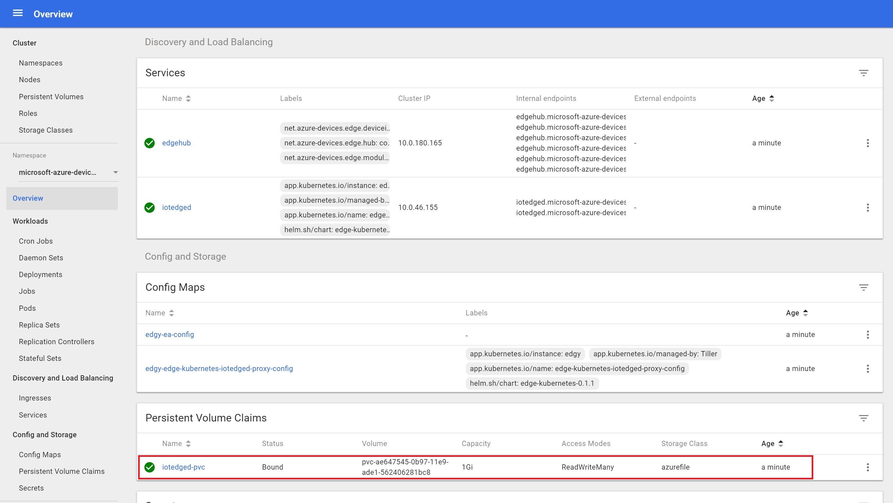

# Persistent Storage for Edge Security Deamon (iotedged)

At this point you have the Edge Security Deamon (iotedged) pod that uses the **container file system** to store the certificate files and the master encryption key. In case the iotedged pod gets recreated by the Kubernetes controller, it will end up generating brand new certificates and encryption keys thereby disabling all existing modules. Therefore, this is not the best approach for high availability scenarios.

If we want to gain HA benefits, we need to run the iotedged pod with [Persistent Volume](https://kubernetes.io/docs/concepts/storage/persistent-volumes/) instead of using the container file system to save its state. This way, if the iotedged pod gets recreated by the Kubernetes controller, it will continue to use the same encryption key and root CA that it had created before and consequently edge modules won't be disabled.

## Deploy a Storage Class

We are going to create a [Storage Class](https://docs.microsoft.com/en-us/azure/aks/azure-files-dynamic-pv#create-a-storage-class) to define how an Azure file share will be created. If you followed the [Create Azure Resources](./create-azure-resources.md) step in this lab, you already have a storage account created for Kubernetes resource group (the one with the *MC_* prefix).


In the `scripts/aks` folder, open the `edge-storage.yaml` file in a text editor and update the `skuName` (if needed) and `storageAccount` parameters:

```yaml
kind: StorageClass
apiVersion: storage.k8s.io/v1
metadata:
  name: azurefile
provisioner: kubernetes.io/azure-file
mountOptions:
  - dir_mode=0777
  - file_mode=0777
  - uid=1000
  - gid=1000
parameters:
  skuName: Standard_LRS
  storageAccount: mystorageaccount
```

Now deploy the storage class in your Kubernetes cluster:

```sh
kubectl apply -f ./edge-storage.yaml
```

Then list all storage classes to make sure it was created successfully:

```sh
kubectl get sc
```

Open the `deploy-helm-pvc.sh` script in a text editor and edit variables:

```sh
# Variables
keyvault_name="your_keyvault_name"
device_prefix="gateway"
storage_class_name="azurefile"
pvc_name="iotedged-pvc"
```

Before deploying the new Edge helm chart, make sure you deleted the existing one:

```sh
helm del --purge edgy
```

Then run the script:

```sh
./deploy-helm-pvc.sh
```

It can take some seconds to provision all resources. The script will deploy the Edge Helm chart configured to use persistent volume and will automatically create the [Persistent Volume Claim (PVC)](https://kubernetes.io/docs/concepts/storage/persistent-volumes/#persistentvolumeclaims). Now you can check if the PVC was created successfully through the `kubectl` or the Kubernetes dashboard:


